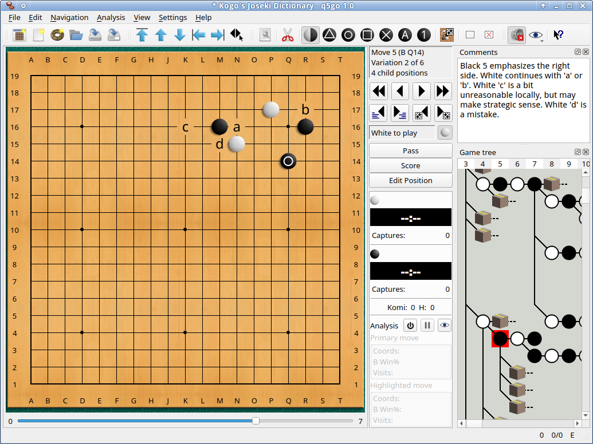
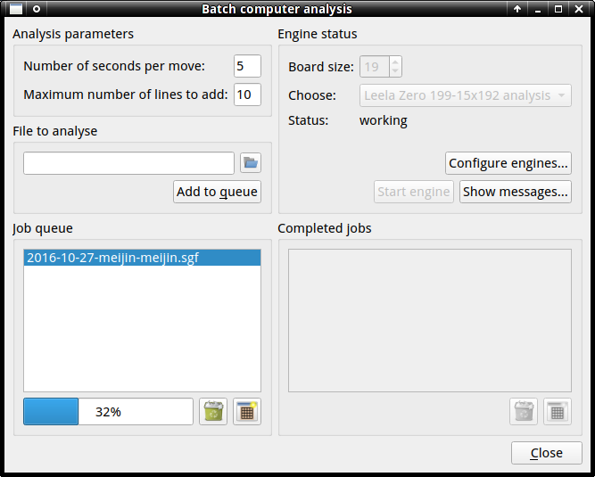
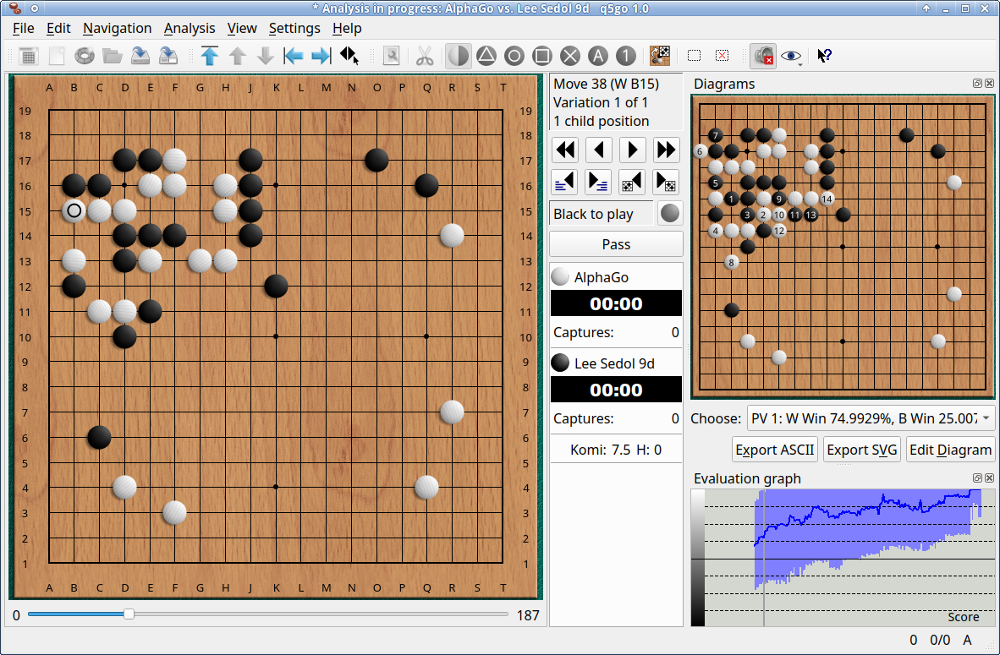
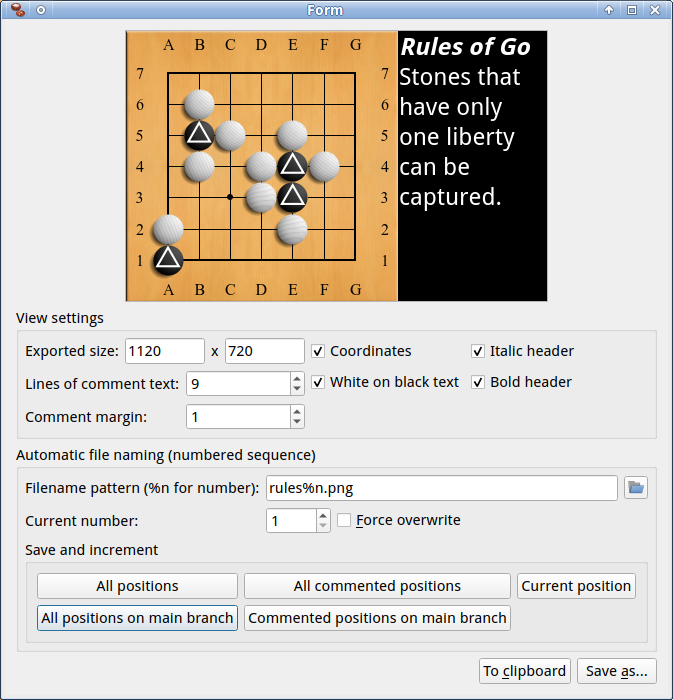
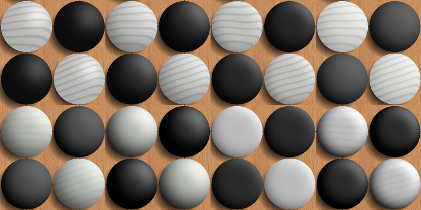
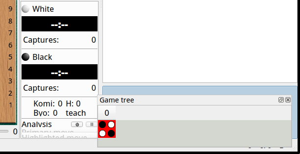
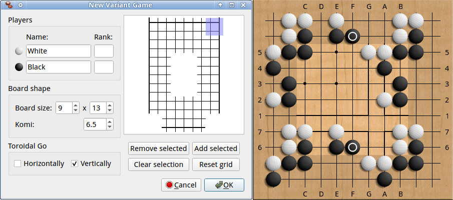

## q5Go 1.1

This is a tool for Go players which performs the following functions:
- SGF editor
- Analysis frontend for KataGo, Leela Zero or compatible engines
- GTP interface
- IGS client
- Export to a variety of formats

The basic goal for this program is to provide an everyday SGF editor
that is fast, easy and convenient to use and does everything you could
want out of such a tool.  Some of the more unusual features include a
Go diagram exporting function for sites like lifein19x19.com or
Sensei's library, as well as SVG vector graphics or slide export.
q5go also supports some non-standard Go variants. For beginners, tutorials
that explain the rules and basic tactics are included.

This program is based on the old Qt3 version of qGo, but ported to Qt5
and modernized.



These are the major user-visible changes in 1.1:
 * Performance improvements when loading and editing very large SGF files.
 * q5go can now detect when an observed game on IGS is adjourned and restarted
   and follow it in the same window. This requires the server to be set to
   non-quiet mode.
 * When playing an engine, there is now a "Play again" button.
 * In an online match with Canadian time, time warnings can now be enabled
   for remaining average time, not just remaining total time.
 * In an online match, remaining seconds in low time situations can now be
   shown on the opponent's last placed stone.
 * Added a "Go terminology" SGF to the tutorials.
 * The greeter window now has a hint to choose "Play online" for a full set
   of menus.
 * The program is more helpful when detecting a broken SGF written by Jago.
 * Added more helpful error messages when editing servers in the preferences.
 * Score evaluations are now shown in the board window when analysis is on.
 * Added a feature to visualize connected stones by drawing thick lines
   between them. May be helpful for beginners.
 * GTP support was extended to support board sizes > 25, for KataGo.

Version 1.1.1 is mostly a bug-fix release to properly suppert saving and
loading large board sizes. But there are also a few additions:
 * There is now a tool to manage and remove the information added by engine
   analysis from a given SGF file.
 * It is now possible to save all variations in a file into separate files.
 * It is possible to choose a path for autosaving online games.

See VERSION_HISTORY for a history of changes.

## Overview of features

### Analysis mode

q5Go supports not only play against AI engines, but can also connect to
KataGo or Leela Zero to use it as an an analysis tool, displaying statistics
such as win-rates, scores (when using KataGo), and visit counts, and
displaying variations.  This is available both for local SGF editing, and
for observing on-line games.  By middle-clicking or shift-clicking on a
displayed variation, it can be added to the game record.


There is also a batch analysis mode, where the user can queue a number of
SGF files for analysis. Evaluations and variations are added automatically,
the variations are presented as diagrams.  The file can be observed
during analysis.




It is possible to run analysis with multiple engines, or with different
komi values.  q5go keeps track of these separately and displays multiple
evaluation graphs.


### Export
q5Go allows the user to export board positions as ASCII diagrams suitable
for Sensei's Library or the lifein19x19.com forums, or in the SVG vector
graphics format which should be suitable for printing.  In both cases,
the user can select a sub-area of the board to be shown in the export,
and it is possible to set a position as the start of move numbering, so
that sequences of moves can be shown in the exported diagram.


Another option is slide export; this produces images of a fixed size
containing both the board and the comments.  The user can specify a
filename template, saving diagrams can then be automated: at each step,
the pattern "%n" in the template is replaced with an incrementing
diagram number.



### SGF diagrams

It is possible to set a game position as the start of a diagram.  This is
has several use cases:
- Subdividing a game record into printable diagrams.  Figures can be
  exported to ASCII and SVG, in whole or in part, just like regular
  board positions.
- Allowing variations to be shown in a separate board display
- Neatly organizing engine lines when performing an analysis

### Configurable appearance

The look of the board and stones can be configured to suit the user's
personal taste.  The stones are generated in a shaded 3D look, and both
the shape and the lighting can be changed.



There are several presets for the wood image, and the user can also
supply a custom file.


### Configurable user interface layout

All optional elements of the board window reside in freely moveable and
resizable docks, giving the user flexibility to create exactly the layout
they want.  These layouts can be saved and restored, and the program
tries to restore the correct layout whenever a new window is opened.



### Beginner tutorials

Choosing "Learn Go" in the greeter window brings up a window with a
selection of beginner tutorials, covering topics such as the basic
rules, life and death, captures/connections and the opening.


### Database support

q5go can access a Kombilo database and search it by player name or
game event or date. This functions as an alternative file open dialog
with preview functionality.


### Go variants

q5go supports rectangular and toroidal boards.  Note that the latter
can only be saved in a non-standard SGF format since the specification
does not allow for it.  When playing on a torus, q5go can be configured
to show a larger area than the actual board dimensions, duplicating parts
of the position for a better overview.  Also, the board can be dragged
with the middle mouse button.

In addition to that, it is possible to set up a board with some of the
intersections removed.



The screenshot shows the variant game dialog and a (different) position
with both axes set to be toroidal.

## Compiling

On Linux, make a build subdirectory, enter it, and run
```sh
  qmake ../src/q5go.pro PREFIX=/where/you/want/to/install
```
followed by make and make install.  If the pandoc tool is installed, this
README.md file will be converted to html and installed, and can then be
viewed through a menu option.

On Windows, download the Qt tools and import the q5go.pro project file
into Qt Creator.
