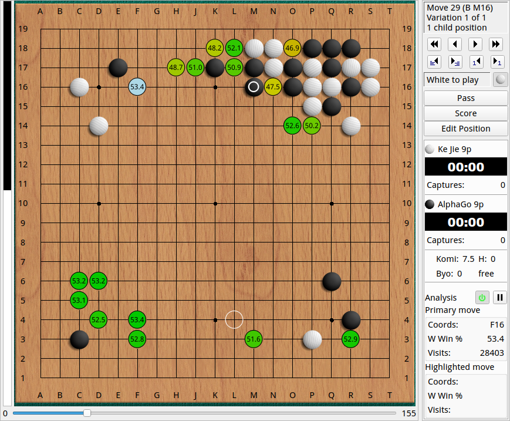
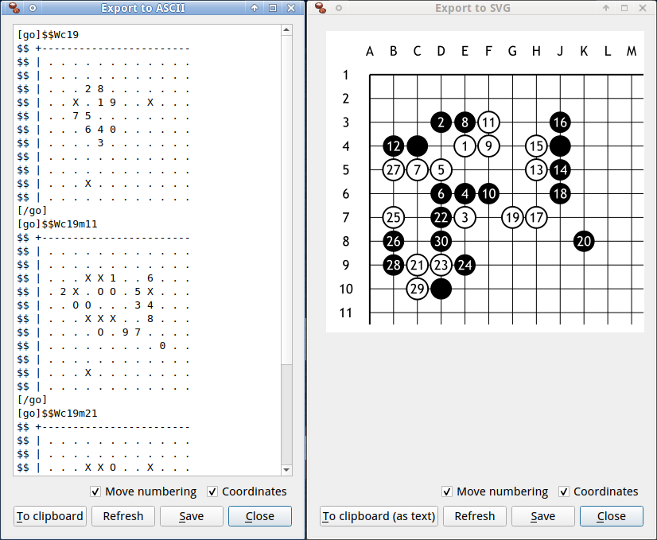
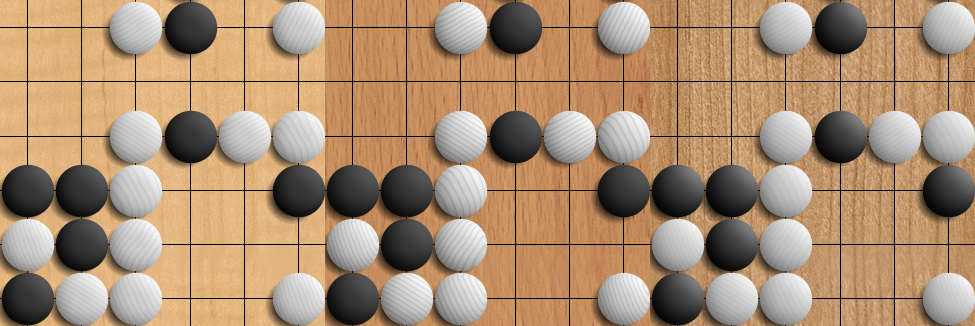

## q5Go 0.4

This is a Go player's tool, an SGF editor/GTP interface/IGS client.  It is
based on the old Qt3 version of qGo, but ported to Qt5 and modernized.

The basic goal for this program is to provide an everyday SGF editor
that is fast, easy and convenient to use and does everything you could
want out of such a tool.  Some of the more unusual features include a
Go diagram exporting function for sites like lifein19x19.com or
Sensei's library, as well as SVG vector graphics export.  q5go also supports
some non-standard Go variants.


Version 0.4 adds the following features:
 * Support for rectangular boards
 * Support for toroidal boards (with an extended view option and
   scrolling)
 * On-line observer lists, which were dropped in the initial versions
   of q5go, are functioning again
 * Likewise for move time annotations

See VERSION_HISTORY for a history of changes.

## Overview of features

### Analysis mode
q5Go supports not only play against AI engines, but can also connect to
Leela Zero to use it as an an analysis tool, displaying statistics such
as win-rates and visit counts, and displaying variations.  This is
available both for local SGF editing, and for observing on-line games.
By middle-clicking or shift-clicking on a displayed variation, it can
be added to the game record.



### Export
q5Go allows the user to export board positions as ASCII diagrams suitable
for Sensei's Library or the lifein19x19.com forums, or in the SVG vector
graphics format which should be suitable for printing.  In both cases,
the user can select a sub-area of the board to be shown in the export,
and it is possible to set a position as the start of move numbering, so
that sequences of moves can be shown in the exported diagram.



### Configurable appearance

The look of the board and stones can be configured to suit the user's
personal taste.  The stones are generated in a shaded 3D look, and both
the shape and the lighting can be changed.


There are several presets for the wood image, and the user can also
supply a custom file.



### Go variants

q5go supports rectangular and toroidal boards.  Note that the latter
can only be saved in a non-standard SGF format since the specification
does not allow for it.  When playing on a torus, q5go can be configured
to extend the board past its regular dimensions, duplicating parts of
the position for a better overview.  Also, the board can be dragged
with the middle mouse button.


The screenshot shows the variant game dialog and a (different) position
with both axes set to be toroidal.

## Compiling

Make a build subdirectory, enter it, and either run
```sh
  ../configure
```
or
```sh
  qmake ../src/q5go.pro
```

followed by make.  The latter is probably recommended as the automake system
is somewhat cobbled-together.
